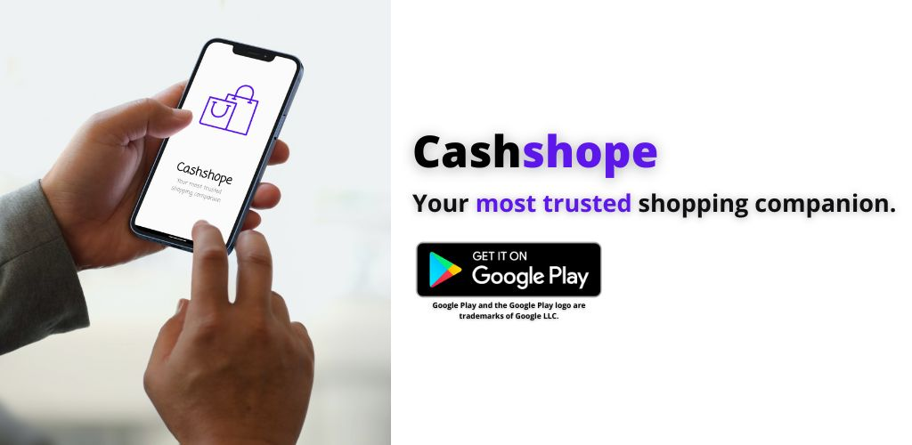
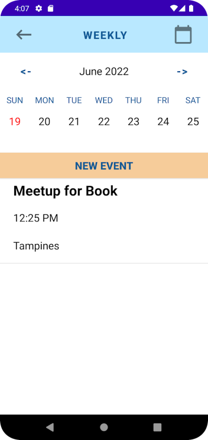

# Cashshope: Chat, Shop & Sell

  
  
  

## Team Members
Tan Kai Zhe | S10219390  
Lim Hong Ying | S10223298  
Ooi Jun Heng Ryan | S10223647  
William Francis Siah | S10222938  
Koh Han Jie Isaac | S10222275  

## Description
Download the Cashshope app now to interact with the huge Cashshope community, discover and buy all
the things you need at competitive prices!

Cashshope is a modern and user-friendly shopping platform for all you needs! Here at
Cashshope, we aim to provide a safe space online for all individuals to shop to their hearts' content. 
Not only do we give second-hand items a chance, the platform allows like-minded individuals to interact 
with each other, and to develop a common interest! See an item you like? Just click on it and start chatting 
away! See an interesting post? Do the same thing and start chatting!

With Cashshope at your side, you may shop in peace as Cashshope is your very own shopping companion!
Join the Cashshope family now to enjoy great deals and benefits:
1) Meeting Calendar: Ensure that you don't miss your meetups
2) Chatting: Interact with like-minded individuals
3) Wishlist: See something that you like, but don't need it for now? Just add it to your wishlist!

## Roles and Contributions
|Member|Contributions|
|---|---|
|Tan Kai Zhe|Homepage, Main Activity, Search Activity, Firebase Tools, Graphics/Illustrations & PlayStore Management|
|Lim Hong Ying|Listings page, Individual listing page, Wishlist page, Firebase implementation for listings, individual listings, and wishlist|
|Ooi Jun Heng Ryan|Meeting Planner page, WeekView and MonthView calendars, Event pages|
|William Francis Siah|Chat function (Chat List, Chat page, MemoryData etc.), Linking Individual Listing to Chat page|
|Koh Han Jie Isaac|Splashpage, Login page, Signup page, User Profile and Setting Permissions, Graphics/Illustrations|

## Features
### Homepage

### Search

### Meeting Planner

### Chat

## User Guide
1. Sign up a new account or log in with the credentails (email address and password) of an existing user account to access Cashshope.
2. Grant Cashshope with the permissions that it needs to function properly. This includes access to the device's storage and internet.
3. The hompage is an overview of all the functions in the app, as well as to view the newest listings:
   - Press the 🔍 button to search for a listing.
   - Press the 🛒 button to view your wishlist.
   - Press the 💬 button to access the chat feature.
   - Press the "Listings" button to access all the listings on Cashshope.
   - Press the "Meeting Planner" button to view the meeting planner feature.
   - Press the "+" button to create a new listing.
   - Press the 👤 button to access your user account profile.
   - Click on any of the listing cards to view detailed information on the listing.
