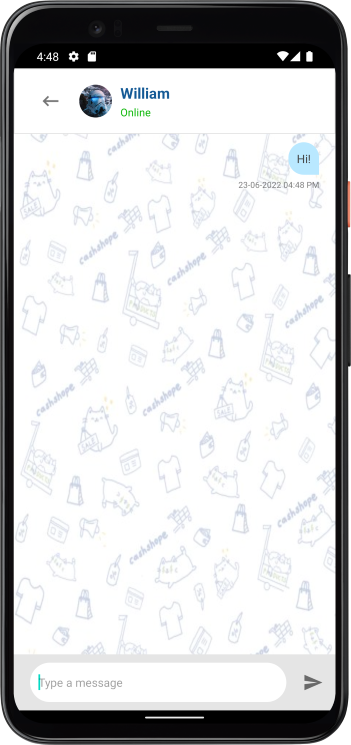

# Cashshope: Chat, Shop & Sell

  
  
  

## Team Members
Tan Kai Zhe | S10219390  
Lim Hong Ying | S10223298  
Ooi Jun Heng Ryan | S10223647  
William Francis Siah | S10222938  
Koh Han Jie Isaac | S10222275  

## Description
Download the Cashshope app now to interact with the huge Cashshope community, discover and buy all the things you need at competitive prices!

Cashshope is a modern and user-friendly shopping platform for all you needs! Here at Cashshope, we aim to provide a safe space online for all individuals to shop to their hearts' content. Not only do we give second-hand items a chance, the platform allows like-minded individuals to interact with each other, and to develop a common interest! See an item you like? Just click on it and start chatting away! See an interesting post? Do the same thing and start chatting!

With Cashshope at your side, you may shop in peace as Cashshope is your very own shopping companion! Join the Cashshope family now to enjoy great deals and benefits 🎁:

📅 Meeting Calendar: Ensure that you don't miss your meetups  
💬 Chatting: Interact with like-minded individuals  
🌠 Wishlist: See something that you like, but don't need it for now? Just add it to your wishlist, and you'll get it one day!  

## Roles and Contributions
|Member|Contributions|
|---|---|
|Tan Kai Zhe|Homepage, Main Activity, Search Activity, Firebase Tools, Graphics/Illustrations, PlayStore Management & App Publication (Description, Release Notes, User Guide .etc), [Terms and Conditions](https://cashshope.japaneast.cloudapp.azure.com/tnc), Terms and Conditions & Privacy Policy Activity, Stripe Onboarding for Seller, Stripe Checkout Activity, Payment Method Activity, StripeUtils Class for API Management, Stripe Backend Server Endpoint, Stripe Express Dashboard for Sellers|
|Lim Hong Ying|Listings page, Individual listing page, Wishlist page, Firebase implementation for listings, individual listings, and wishlist, Play Store app updates|
|Ooi Jun Heng Ryan|Meeting Planner page, WeekView and MonthView calendars, Event pages|
|William Francis Siah|Chat function (Chat List, Chat page, MemoryData etc.), Linking Individual Listing to Chat page|
|Koh Han Jie Isaac|Splashpage, Login page, Signup page, User Profile and Setting Permissions, Graphics/Illustrations|

## Features
### Homepage
Provides an overview of all the features of Cashshope, as well as the latest listings that have been posted.

### Search
Looking for something specific? Just tap on the magnifying glass and search it up!

### Wishlist
You can now save your favourite listings for future reference.

### Chat
You can also chat with other Cashshopers!

### Meeting Planner
Afraid of missing out on meetups with one of the Cashshopers? Fret not! Simply check your very own meeting planner to see your schedule!

### Listing
View all the listings on Cashshope!

Tap on the item that you like to see even more details!

### Create Listing
Don't need something anymore? Put it up for sale! Not only are you getting back some cash in return, you are also doing something good for
the environment by promoting reusability.

### User Profile
Feeling fancy today? Customize your profile!

## User Guide
1. Sign up a new account or log in with the credentails (email address and password) of an existing user account to access Cashshope.
2. Grant Cashshope with the permissions that it needs to function properly. This includes access to the device's storage and internet.
3. The hompage is an overview of all the functions in the app, as well as to view the newest listings:
   - Press the 🔍 button to search for a listing.
   - Press the 🛒 button to view your wishlist.
   - Press the 💬 button to access the chat feature.
   - Press the "Listings" button to access all the listings on Cashshope.
   - Press the "Meeting Planner" button to view the meeting planner feature.
   - Press the "+" button to create a new listing.
   - Press the 👤 button to access your user account profile.
   - Click on any of the listing cards to view detailed information on the listing.
4. To delete your User Account, please note that this action is **IRREVERSIBLE**.
   - Press the 👤 button to access your user account profile page.
   - Press the red "Delete Account" button to delete your account.
   - All your records and data stored on Cashshope's server will be deleted and it is non-recoverable.

### For Sellers
In order to allow your buyers to purchase your items via debit or credit card:
- You must enable the "Stripe" option whenever you create a new listing, as our payments are managed by Stripe.
- If it is your first time enabling the "Stripe" option, you will be required to go through a mandatory onboarding process with Stripe to ensure that Stripe has what it needs to know, including the items that you are selling, and to verify that you are indeed a valid person, through the verification of official identity documents such as an Identify Card, Driving License, or SingPass.
- After the onboarding process, you may proceed to list your item for sale, and you will receive payment to your bank account or card that you have connected to Stripe during the onboarding process, when a purchase has been made by a buyer.
- If you did not fill in the required information, you will be required to resume the onboarding process before you are able to create a listing, or otherwise, your listing will be created but buyers will not be able to checkout through Stripe.

### For Buyers
In order to pay with a valid debit or credit card:
- Select a listing that has a "Buy Now" button.
- Click on the "Buy Now" button and you will be brought to the Checkout page.
- Validate and key in the required information including card details and delivery method.
- Click on the Checkout button to complete the purchase.
- Should the financial instituition in which your card has been registered with (card issuer), requires additional verification such as 3D Secure, you will be prompted by Stripe to perform additional actions.

## Disclaimer
Before you proceed with our service, do read and agree to our [Terms and Conditions](https://cashshope.japaneast.cloudapp.azure.com/tnc), as well as [Privacy Policy](https://westwq.github.io/MADPrivacy/).

Do note that Cashshope is provided as is to you, the user, and the app is only currently available to users in Singapore. We are NOT liable for any claims or issues occured between the seller and the buyer, proceed at your own risk when your purchase or sell goods on Cashshope. We do not store any confidential information such as credit card details or shipping addresses on our servers, other than your user information in which you have provided during the initial sign-up process. Confidential information as mentioned above is managed and processed by our payment service provider, Stripe.  

When you use Stripe for buying and selling of goods, including as a payment method, or to receive funds, you agree to Stripe's [Term of Services](https://stripe.com/en-sg/customer-portal/legal).

Finally, should you wish to terminate your service with us, feel free to follow the instructions above to delete your account via the user profile page.
