# Cashshope: Chat, Shop & Sell

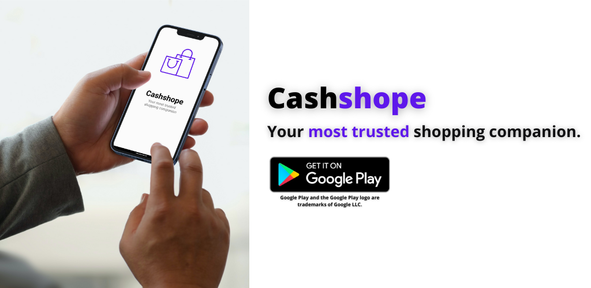

  
  
  

## Team Members
Tan Kai Zhe | S10219390  
Lim Hong Ying | S10223298  
Ooi Jun Heng Ryan | S10223647  
William Francis Siah | S10222938  
Koh Han Jie Isaac | S10222275  

## Description
Download the Cashshope app now to interact with the huge Cashshope community, discover and buy all the things you need at competitive prices!

Cashshope is a modern and user-friendly shopping platform for all you needs! Here at Cashshope, we aim to provide a safe space online for all individuals to shop to their hearts' content. Not only do we give second-hand items a chance, the platform allows like-minded individuals to interact with each other, and to develop a common interest! See an item you like? Just click on it and start chatting away! See an interesting post? Do the same thing and start chatting!

With Cashshope at your side, you may shop in peace as Cashshope is your very own shopping companion! Join the Cashshope family now to enjoy great deals and benefits 🎁:

📅 Meeting Calendar: Ensure that you don't miss your meetups  
💬 Chatting: Interact with like-minded individuals  
🌠 Wishlist: See something that you like, but don't need it for now? Just add it to your wishlist, and you'll get it one day!  

## Roles and Contributions
|Member|Contributions|
|---|---|
|Tan Kai Zhe|Homepage, Main Activity, Search Activity, Firebase Tools, Graphics/Illustrations, PlayStore Management & App Publication (Description, Release Notes, User Guide .etc)|
|Lim Hong Ying|Listings page, Individual listing page, Wishlist page, Firebase implementation for listings, individual listings, and wishlist, Play Store app updates|
|Ooi Jun Heng Ryan|Meeting Planner page, Weekly Calendar, Monthly Calendar, Event page, EventEdit Page, Firebase implementation for events|
|William Francis Siah|Basic Chat Activity, Basic ChatList Activity, ChatInfo, MessageList, MemoryData, Linking Individual Listing to Chat page|
|Koh Han Jie Isaac|Splashpage, Login page, Signup page, User Profile and Setting Permissions, Graphics/Illustrations| Stage 2   Wishlist counter, App Widget to view today listing, Delete account, Change account details 

### Stage 2
|Member|Contributions|
|---|---|
|Tan Kai Zhe|Firebase Tools, StripeUtils, CheckoutActivity, PaymentMethodActivity, StripeDialog, DeliveryAddress, Stripe Backend Integration, [Terms and Conditions](https://cashshope.japaneast.cloudapp.azure.com/tnc), Terms and Conditions Activity,m Privacy Policy Activity, , Stripe Onboarding for Seller in newlisting, CheckoutActivity, PaymentMethodActivity, StripeUtils, Stripe Backend Server, Stripe Express Dashboard for Sellers in User_Profile_Fragment|
|Lim Hong Ying||
|Ooi Jun Heng Ryan|Integrated Google Calendar to sync with events (Add, Edit, Delete events from Google Calendar), EventPage Activity, EventDetails Activity, Usage of Calendar Permission, Improved event details|
|William Francis Siah|ChatAddUser Activity, Improved Chat Activity (User Status, Sending Images), Improved ChatList Activity (Manual/Auto add chat, Delete chat, Search Feature, Unseen Messages), Updated MessageList, RecyclerViewInterface|
|Koh Han Jie Isaac|Wishlist counter in User profile page, App Widget to view today listing Activity, RemoteViewFactory interface for widget, Button to reload widget, Delete account Activity, Change account details Activity|

## Features
### Homepage
Provides an overview of all the features of Cashshope, as well as the latest listings that have been posted.

### Search
Looking for something specific? Just tap on the magnifying glass and search it up!

### Wishlist
You can now save your favourite listings for future reference.

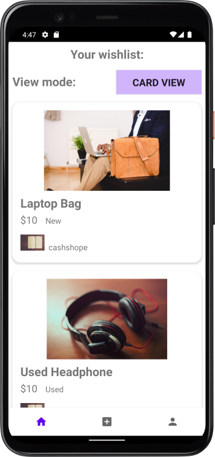

### Chat
You can also chat with other Cashshopers!

  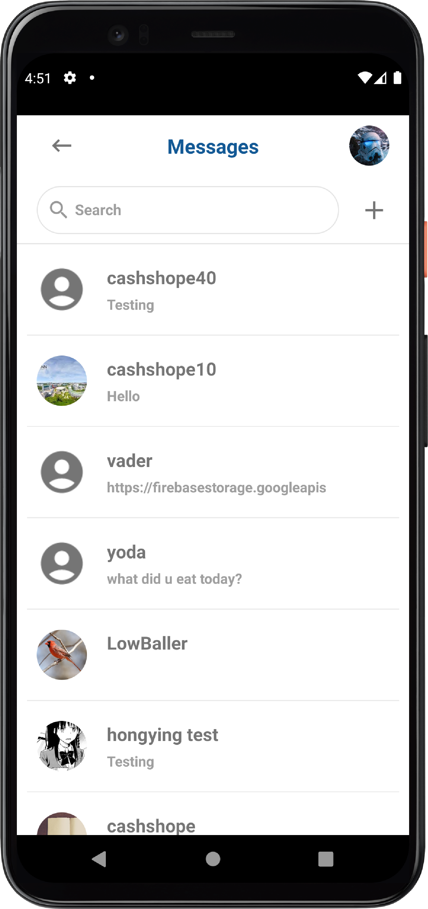
  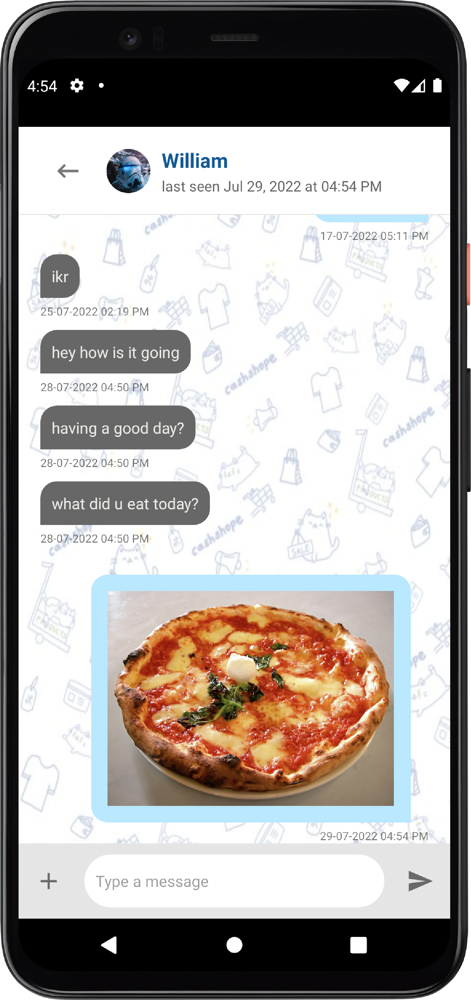

### Meeting Planner
Afraid of missing out on meetups with one of the Cashshopers? Fret not! Simply check your very own meeting planner to see your schedule!

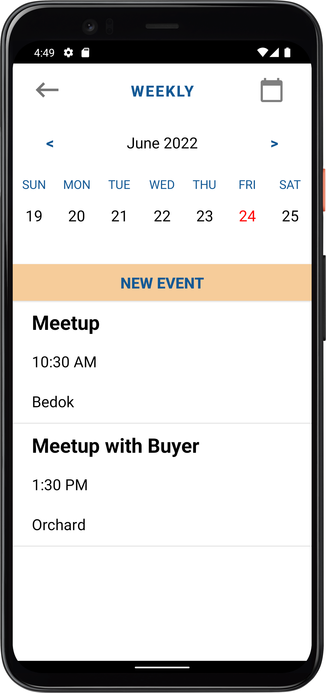

### Listing
View all the listings on Cashshope!

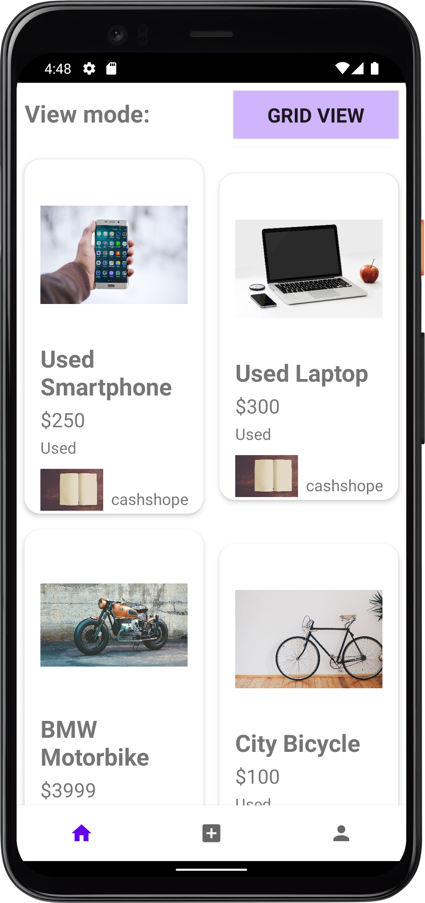

Tap on the item that you like to see even more details!

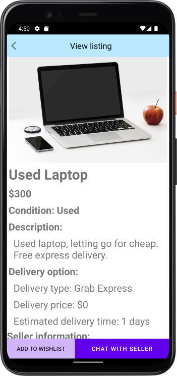

### Create Listing
Don't need something anymore? Put it up for sale! Not only are you getting back some cash in return, you are also doing something good for
the environment by promoting reusability.

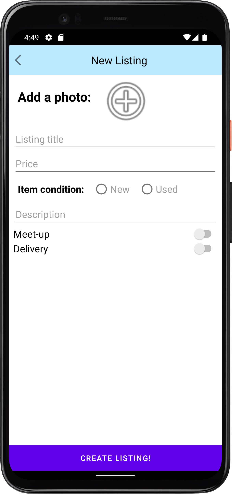

### User Profile
Feeling fancy today? Customize your profile! 

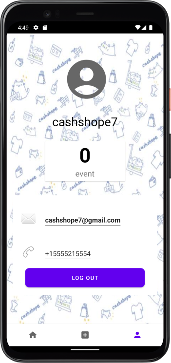
Go to the customize profile page to change your profile details
 
 

 
 
Remeber to reauthenticate in order to change your account information!
 
 

 
 

### Delete Account
Dont want to keep your cashshope account anymore? You can now delete your account!But remember, this process is non reversible!
 
 

 
 
Please reauthenticate yourself as this is a very sensitive action
 
 

 
 
### App Widget
 
Too lazy to open the app, fret not, you can now browse listings from the comfort of your homescreen!(This widget only works when you are signed in due to database rules, so remember to sign in !)
 
 

### Checkout
See that one thing you fancy? Click the "Buy Now" button (selected listings only) to perform an easy and fuss-free checkout process.  
 
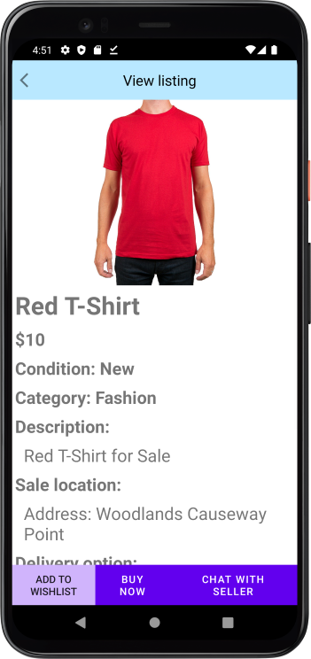
 
After which, you will be brought to this page:  
 
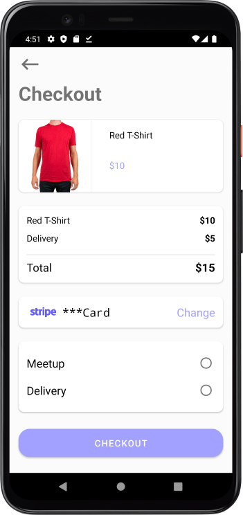
 
Click the "Change" button to key in your payment information, when done, tap on "Confirm".  
 
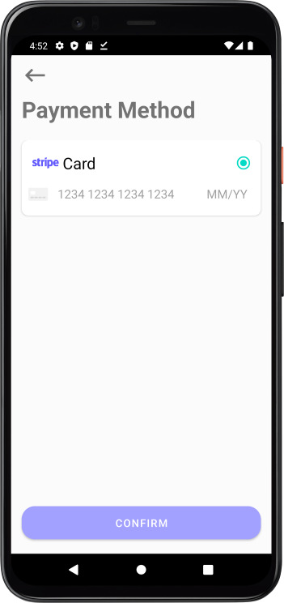  
 
Afterwards, select your delivery method of choice, and you are required to key in your delivery details such as receiving address and recipient's name.
 
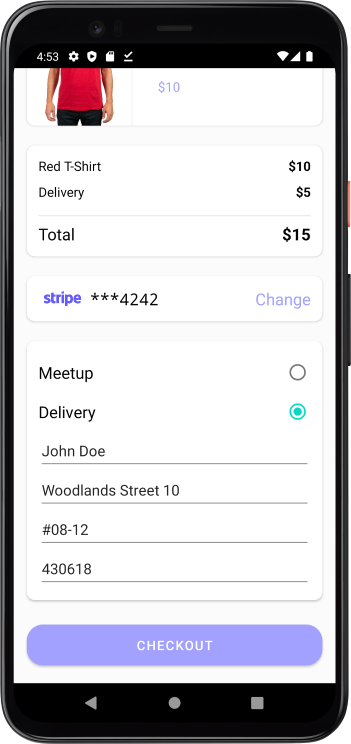  

When done, you're good to go! Just simply tap on the "Checkout" button, and let Stripe handle the rest for you. Please do note that you may be required to go through an additional stage of identity verification as required by your card issuer:
 
 
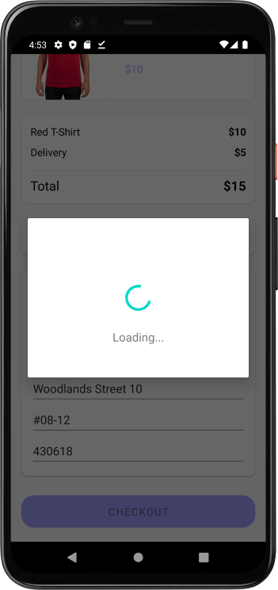
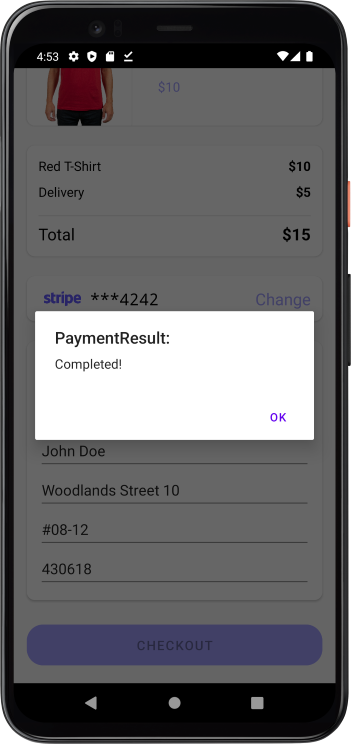  

See below for screenshots on the additional 3DS or Two-factor Authentication process:
 
 
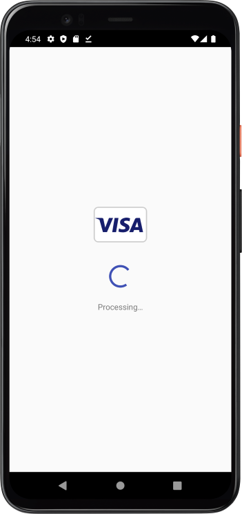 
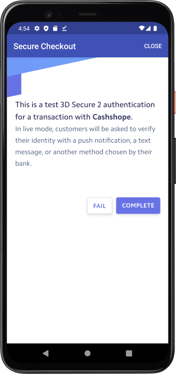  

## User Guide
1. Sign up a new account or log in with the credentails (email address and password) of an existing user account to access Cashshope.
2. Grant Cashshope with the permissions that it needs to function properly. This includes access to the device's storage and internet.
3. The hompage is an overview of all the functions in the app, as well as to view the newest listings:
   - Press the 🔍 button to search for a listing.
   - Press the 🛒 button to view your wishlist.
   - Press the 💬 button to access the chat feature.
   - Press the "Listings" button to access all the listings on Cashshope.
   - Press the "Meeting Planner" button to view the meeting planner feature.
   - Press the "+" button to create a new listing.
   - Press the 👤 button to access your user account profile.
   - Click on any of the listing cards to view detailed information on the listing.
4. To delete your User Account, please note that this action is **IRREVERSIBLE**.
   - Press the 👤 button to access your user account profile page.
   - Press the red "Delete Account" button to delete your account.
   - All your records and data stored on Cashshope's server will be deleted and it is non-recoverable.

## Stripe Guide
  
We partner with Stripe, one of the world' leading online payment infrastructure, to provide you a much better shopping experience. Sellers can now easily view and track your customers' purchases. For buyers, you can now buy items with just a few taps using your card of choice! 

### For Sellers
In order to allow your buyers to purchase your items via debit or credit card:
- You must enable the "Stripe" option whenever you create a new listing, as our payments are managed by Stripe.
- If it is your first time enabling the "Stripe" option, you will be required to go through a mandatory onboarding process with Stripe to ensure that Stripe has what it needs to know, including the items that you are selling, and to verify that you are indeed a valid person, through the verification of official identity documents such as an Identify Card, Driving License, or SingPass.
- After the onboarding process, you may proceed to list your item for sale, and you will receive payment to your bank account or card that you have connected to Stripe during the onboarding process, when a purchase has been made by a buyer.
- If you did not fill in the required information, you will be required to resume the onboarding process before you are able to create a listing, or otherwise, your listing will be created but buyers will not be able to checkout through Stripe.

### For Buyers
In order to pay with a valid debit or credit card:
- Select a listing that has a "Buy Now" button.
- Click on the "Buy Now" button and you will be brought to the Checkout page.
- Validate and key in the required information including card details and delivery method.
- Click on the Checkout button to complete the purchase.
- Should the financial instituition in which your card has been registered with (card issuer), requires additional verification such as 3D Secure, you will be prompted by Stripe to perform additional actions.

## Chat Guide
  #### Chat List
   - Press the "+" button to add other users to your chat list.
   - Press and hold on a user in your chat list to remove them from your list (you can always add them back).
   - Press the search 🔍 bar to search for any users in your chat list.
   - Number of unseen messages will be displayed for each chat  
  #### Chat
   - Type a message and press ➢ button to send
   - Press the "+" button to send a picture from your phone's gallery
   - Status of the other user will be displayed at the top, below their name  
  #### Things to note
   - If you are in any chat page your status would be changed to "online".
   - Once exiting any of the chat pages (e.g. Return back to homepage), your status would be changed to "offline" and other users can see your last seen date and time.  
  ## Widget Guide
  - Log in to the application and then create a widget
  - Remember, widget only works when you are logged in for security purposes!
  - Press the refresh button to get todays listings
  - The widget is scrollable, so to see more items, give the widget a scroll!
  ### WishList counter
  - Keep track of the number of wish list items you have!
  - Click on the wish list counter card to see your wish list!
  ### Delete account
  - Click on the delete account button
  - Before procceding, please press yes if you want to procced with deleting your item
  - Remember, this action cannot be reversible so think carefully
  - Enter your credentials again to make sure it is you
  - Click on the delete button
  - Your account has been deleted!
  ### Change Account details
  - Go to your profile page
  - Click the change account details button
  - Enter your changed details
  - Re-enter your credentials
  - Click the button
  - Your account details have been changed!
  
  

## Disclaimer
Before you proceed with our service, do read and agree to our [Terms and Conditions](https://cashshope.japaneast.cloudapp.azure.com/tnc), as well as [Privacy Policy](https://westwq.github.io/MADPrivacy/).

Do note that Cashshope is provided as is to you, the user, and the app is only currently available to users in Singapore. We are NOT liable for any claims or issues occured between the seller and the buyer, proceed at your own risk when your purchase or sell goods on Cashshope. We do not store any confidential information such as credit card details or shipping addresses on our servers, other than your user information in which you have provided during the initial sign-up process. Confidential information as mentioned above is managed and processed by our payment service provider, Stripe.  

When you use Stripe for buying and selling of goods, including as a payment method, or to receive funds, you agree to Stripe's [Term of Services](https://stripe.com/en-sg/customer-portal/legal).

Finally, should you wish to terminate your service with us, feel free to follow the instructions above to delete your account via the user profile page.
